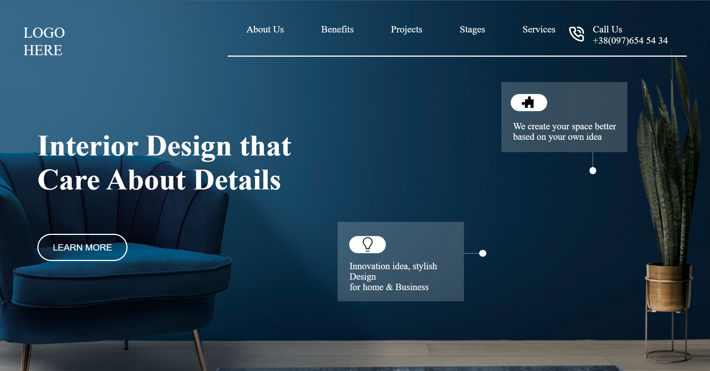

# Hey Welcome

Hi, My name is Uvesh Khatri and I have completed the 10th Project of the iNeuron Full Stack Course.

# Project 10

In this project i have created a interior Design Landing Page from Scratch. And i have learnt a lot of things like Position, flexbox.

It took me 1 day to complete this project
## Tech Stack Used 
- HTML5

- CSS

## My Project is looking like :

[Live Link](https://uveshkhatri-interior-design-landing-p.netlify.app/)